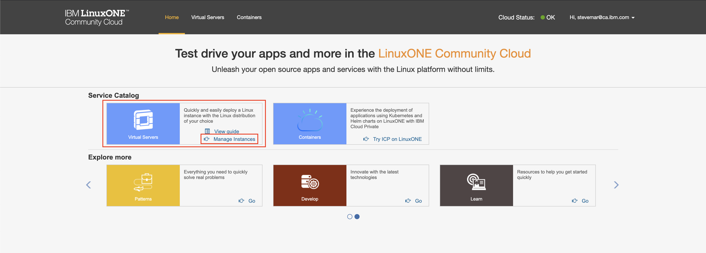

# IBM Watson Assistant with IBM LinuxONE Systems

In this code pattern, you will learn how to build and deploy a cognitive microservice with IBM Cloud Private running in the IBM LinuxONE Community Cloud.

IBM Cloud Private is a private cloud platform for developing and running workloads locally. It is an integrated environment that enables you to design, develop, deploy and manage on-premises, containerized cloud applications behind a firewall. It includes the container orchestrator Kubernetes, a private image repository, a management console and monitoring frameworks.

When you will complete this code pattern, you will understand how to:

* Create an IBM Watson Assistant Service in IBM Cloud
* Build a Docker image from an existing application.
* Deploy a Docker image to IBM Cloud Private.
* Deploy an existing application using the IBM Cloud Private catalog.
* Talk & get it done with IBM LinuxONE systems !

## Architecture


1. Create an IBM Watson Assistant service and configure it.
1. Build and deploy a Docker image to IBM Cloud Private.
1. Build the Docker image from the LinuxONE Community Cloud.
1. Deploy the Docker image to IBM Cloud Private.
1. Instantiate the provisioning chatbot from the IBM Cloud Private catalog.
1. Run the application: Talk and get it done with IBM LinuxONE Systems.

## Included components

* [IBM LinuxONE Systems](https://www.ibm.com/it-infrastructure/linuxone)
* [IBM Z (Mainframe)](https://www.ibm.com/it-infrastructure/z)
* [IBM Cloud Private](https://www.ibm.com/cloud/private)
* [OpenStack](https://www.openstack.org/)
* [Integration with VMWare vRealize Automation](https://www.ibm.com/blogs/systems/making-hybrid-cloud-easier-vmware-ibm-systems/)
* [Watson Assistant](https://www.ibm.com/watson/ai-assistant/)

## Steps

  **PART ONE**

1. [Fork and clone the repo](#1-fork-and-clone-the-repo)
2. [Create Watson services with IBM Cloud](#2-create-watson-services-with-ibm-cloud)
3. [Upload the Watson Assistant workspace](#3-upload-the-watson-assistant-workspace)
4. [Configure `.env` with credentials](#4-configure-env-with-credentials)
5. [Run the application locally](#5-run-the-application-locally)

  **PART TWO**

6. [Provision a LinuxONE virtual server]()
7. [Dockerize your application on LinuxOne]()

  **PART THREE**

8. [Provision an IBM Cloud Private cluster]()
9. [Deploy your application on IBM Cloud Private]()

### 1. Fork and clone the repo

1. Create a [GitHub account](https://github.com/).
1. Fork this GitHub repository to your own GitHub account. It will now be named:

   ```ini
   https://github.com/YOUR_USERNAME/conversation-with-linuxone-using-watson-microservices
   ```

1. Install the [Git command line interface](https://git-scm.com/book/en/v2/Getting-Started-The-Command-Line).
1. Launch a terminal and clone your GitHub repository:

   ```ini
   git clone https://github.com/YOUR_USERNAME/conversation-with-linuxone-using-watson-microservices
   ```

### 2. Create Watson services with IBM Cloud

Create the following services:

* [**Watson Conversation**](https://cloud.ibm.com/catalog/services/conversation)

### 3. Upload the Watson Assistant workspace

* Find the Assistant service in your IBM Cloud Dashboard.
* Click on the service and then click on `Launch tool`.
* Go to the `Skills` tab.
* Click `Create new`
* Click the `Import skill` tab.
* Click `Choose JSON file`, go to your cloned repo dir, and `Open` the workspace.json file in [`data/awap-workspace.json`](data/awap-workspace.json).
* Select `Everything` and click `Import`.

To find the `WORKSPACE_ID` for Watson Assistant:

* Go back to the `Skills` tab.
* Find the card for the workspace you would like to use.
* Click on the three dots in the upper right-hand corner of the card and select `View API Details`.
* Copy the `Workspace ID` GUID. Save it for the .env file


### 4. Configure `.env` with credentials

Our services are created and workspace uploaded. It's now time to let our application run locally and to do that we'll configure a simple text file with the values we want to use. We begin by copying the [`env.example`](env.example) file and naming it `.env`.

```bash
cd AWAPlinuxonecc
cp env.example .env
```

We now populate the key-value pairs with credentials for each IBM Cloud service (Assistant, Speech To Text, and Text To Speech). These values can be found in the `Services` menu in IBM Cloud, by selecting the `Service Credentials` option for each service.

Lastly, the `WORKSPACE_ID` value was retrieved in the previous step, we use that value here.

#### `sample.env`:

```ini
WORKSPACE_ID=<add_assistant_workspace>
ASSISTANT_IAM_APIKEY=<add_assistant_apikey>
```

### 5. Run the application locally

We'll be running the Node.js application in the [`AWAPlinuxonecc`](AWAPlinuxonecc) folder, we will test it locally before packaging it into a Docker image for IBM Cloud Private. In order to run the application, ensure you have installed [Node.js](https://nodejs.org/en/download/) the latest of which comes with `npm` also installed.

> **NOTE**: Ensure you can execute **node -v** and **npm -v** commands from a command line interface before proceeding. This application was most recently tested with `node v11.9.0` and `npm 6.9.0`.

* Go to the `AWAPlinuxonecc` folder of the cloned repository.
* Run `npm install` to install the applications dependencies.

  ```bash
  $ npm install
  audited 7940 packages in 3.303s
  ```

* Run `npm start` to run the application:

   ```bash
   $ npm start
   > conversation-linuxone@0.1.1 start /Users/foo/workspace/conversation-with-linuxone-using-watson-microservices/AWAPlinuxonecc
   > node server.js

   Server running on port: 3000
   ```

* Open a browser and point to [http://localhost:3000/](http://localhost:3000/).
* A webpage with the chatbot application should load. Start a conversation by saying *Hello*.

  

:thumbsup: **CONGRATULATIONS!** You are done with the first part of this code pattern! Now we are going to package and deploy the application for IBM Cloud Private in order to deploy it to IBM LinuxONE Systems.

### 6. Provision a LinuxONE virtual server

We will be using a LinuxOne virtual server to build the Docker image. We'll get access to the virtual server from the [LinuxONE Community Cloud](https://developer.ibm.com/linuxone/).

1. Go to the [LinuxONE Community Cloud](https://developer.ibm.com/linuxone/).

2. Request access to "*Try Virtual Machines on the LinuxONE Community Cloud*".

   

3. Follow the URL in your authorization email to sign in.

4. Once signed in, click on *Manage Instances* under the *Virtual Server* option.

   

5. Provision a LinuxONE virtual server. By providing a name, SSH key pair, and selecting the **SLES12SP3** operating system.

   

6. Your virtual server should now be provisioned and a public IP address provided.

   

7. Log into the virtual server by using `ssh`:

   ```bash
   $ ssh linux1@148.100.245.147
   =================================================================================
   Welcome to the IBM LinuxONE Community Cloud!

   This server is for authorized users only. All activity is logged and monitored.
   Individuals using this server must abide to the Terms and Conditions listed here:
   https://developer.ibm.com/linuxone/terms-of-use/
   Your access will be revoked for any non-compliance.
   ==================================================================================
   linux1@myinstance:~>
   ```

### 7. Dockerize your application on LinuxOne

1. Clone your forked repository on your new Linux virtual server

   ```bash
   git clone https://github.com/YOUR_USERNAME/conversation-with-linuxone-using-watson-microservices
   ```

2. Go to the `AWAPlinuxonecc` folder, look for the file named `cloudaction.js`, and replace `ssh -p YOUR_PORT_NUMBER YOUR_USER@YOUR_PUBLIC_IP_ADDRESS YOUR_PROVISIONING_COMMAND` with the values from the previous section. For instance:

   ```javascript
   // ssh -p 22 linux1@148.100.245.147 echo "From here you can code any deployment from a dialog!"
   ```

   > **NOTE**: Ensure your `.env` file is also on your virtual server before building the image.

3. Build a Docker image with the `docker build` command:

   ```bash
   sudo docker build -t "YOUR_USERNAME-awaplinuxonecc:latest" .
   ```

   > **NOTE**: Do not forget the `.` at the end of the command.

4. Start your Dockerized application by running `docker run`:

   ```bash
   sudo docker run -p 3000:3000 YOUR_USERNAME-awaplinuxonecc
   ```

5. Launch a browser and point to [http://YOUR_IP_ADDRESS:3000](http://YOUR_IP_ADDRESS:3000).

6. Here is a sample conversation to try out:

   ```ini
   Bot: Welcome to AWAP
   You: Hello
   Bot: Hello and welcome to this cognitive demonstration platform, how are you today ?
   You: I am ok and you ?
   Bot: I am ok ! All my functions seem to work properly :-) ! What are we doing today ?
   You: I would like to deploy cloud services on IBM LinuxONE
   Bot: Let's go for Cloud ! I am connected to a Cloud Environment running on a LinuxONE System. It  is based on Openstack, Would you like to work with this environment ?
   You: Yes
   Bot: I will use an Openstack based environment to do Infrastructure-as-a-service or IaaS, for you. Please, provide me with more information (Linux, distribution and vm size) about the cloud service to deploy ?
   You: what can you do ?
   Bot: Please, can you mention the linux image you need ? Redhat, SUSE or Ubuntu ? Can you also specify the Virtual Machine (VM) size you need ? small (1 vcpu) ? medium (2 vcpus) ? or large (4 vcpus) ?
   You: ok provision a linux redhat in a small vm
   Bot: I provisioned a small Virtual Machine with Linux Redhat on it. You can follow its deployment here ACCESS TO CLOUD MANAGER APPLIANCE. Would you like to do another deployment ?
   ```

#### 7.1 Verify the action is working

In our code, an action is creating a sample file (with our selected Linux distribution information) when the chatbot is engaged. We can verify this by performing the following steps:

1. Reconnect to you Linux virtual server:

   ```bash
   ssh linux1@148.100.245.147
   ```

2. List your running containers:

   ```bash
   $ sudo docker ps
   CONTAINER ID   IMAGE              COMMAND                  CREATED            STATUS          PORTS                    NAMES
   6eab36b7265d   awaplinuxonecc:v4   "node /AWAPlinuxon..."   3 minutes ago     Up 3 minutes    0.0.0.0:3000->3000/tcp   upbeat_perlman
   ```

3. Connect to the running container and start a bash process:

   ```bash
   sudo docker exec -i -t <YOUR_CONTAINER_ID> /bin/bash
   ```

4. List the files in `/tmp`:

   ```bash
   root@6eab36b7265d:/tmp# ll /tmp
   total 12
   drwxrwxrwt 1 root root 4096 Nov 13 18:11 ./
   drwxr-xr-x 1 root root 4096 Nov 13 18:10 ../
   -rw-r--r-- 1 root root   54 Nov 13 18:11 RHEL7U5.txt
   ```

5. Output the contents of the file:

   ```bash
   root@6eab36b7265d:/tmp# cat /tmp/RHEL7U5.txt
   From here you can code any deployment from a dialog !
   root@6eab36b7265d:/tmp#
   ```

:thumbsup: **CONGRATULATIONS!** It is time now to deploy this image to our **IBM Cloud Private** cluster.

### 8. Provision an IBM Cloud Private cluster

We will now be using IBM Cloud Private to host our Dockerized application. We'll get access to IBM Cloud Private from the [LinuxONE Community Cloud](https://developer.ibm.com/linuxone/).

1. Go to the [LinuxONE Community Cloud](https://developer.ibm.com/linuxone/).

2. Request access to "*Try Cloud Native Platform on the LinuxONE Community Cloud*".

   

3. Follow the URL in your authorization email to sign in.

   

4. Click the *Catalog* button on the top-right to access the catalog.

   

5. Click on the tile called **awap-cognitive-hybridcloud** to see the overview of the application.

   

### 9. Deploy your application on IBM Cloud Private

1. Check the chart details and click on the **Configure** button to create your container.

   

2. Configure the container:

   

   * Choose a release name.
   * Select `linuxone` as the target namespace.
   * The image repository should point to: `cluster68.icp:8500/codepatterns/awap-cognitive-hybridcloud`.

3. Click the **Install** button. When the process is finished, click **View Helm Release**.

   

4. From the Helm release view, the container details are displayed.

   

   * Click on **Launch** to display the Chatbot microservice.

5. Test your application by saying "Hello". The results will be displayed in the chatbot window.

   

6. Further, you can check the logs to ensure your application is behaving as expected.

   

   If you can access the /tmp of your running docker container you will see a file created with the Linux of your choice.

> **NOTE**: Your account is only available for 48 hours. All your containers will deleted when your account expires.

:thumbsup: **CONGRATULATIONS!** Your  application has been deployed to IBM Cloud Private as a container and has successfully executed a command on your LinuxONE Server.

## Extend the solution

You can now modify [**cloudaction.js**](AWAPlinuxonecc/cloudaction.js) to run whatever command you like. Change the localhost value to the IP address to point to your on-premises server. In order to establish the communication with an on-premises server you need to create an IBM Cloud Service for Integration, named [Secure Gateway](https://console.bluemix.net/catalog/services/secure-gateway):


:thumbsup: **CONGRATULATIONS!** You have successfully completed this code pattern!

## Links

* [IBM Cloud Private](https://www.ibm.com/cloud/private)
* [IBM Cloud Private: Knowledge Center](https://www.ibm.com/support/knowledgecenter/en/SSBS6K/product_welcome_cloud_private.html)

## License

This code pattern is licensed under the Apache Software License, Version 2.  Separate third party code objects invoked within this code pattern are licensed by their respective providers pursuant to their own separate licenses. Contributions are subject to the [Developer Certificate of Origin, Version 1.1 (DCO)](https://developercertificate.org/) and the [Apache Software License, Version 2](https://www.apache.org/licenses/LICENSE-2.0.txt).

[Apache Software License (ASL) FAQ](https://www.apache.org/foundation/license-faq.html#WhatDoesItMEAN)
