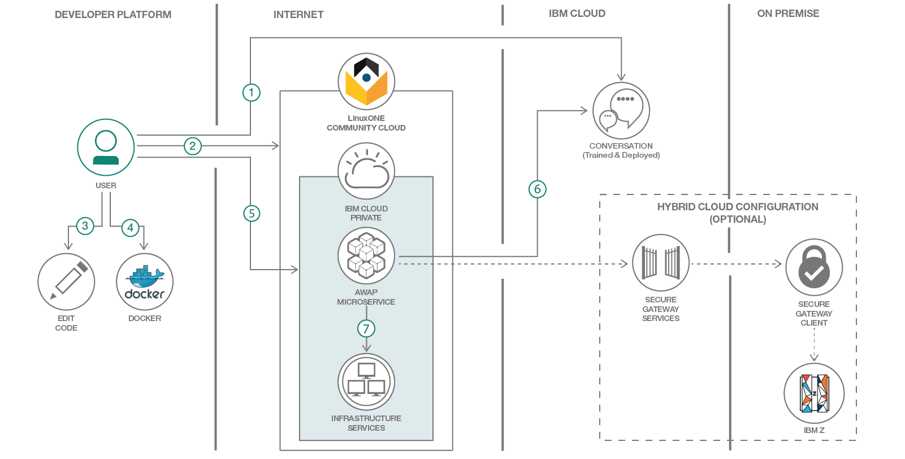
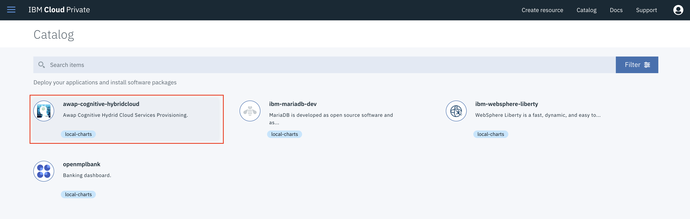

# IBM Watson Assistant with IBM LinuxONE Systems

In this code pattern, you will learn how to build and deploy a cognitive microservice with IBM Cloud Private running in the IBM LinuxONE Community Cloud. 

IBM Cloud Private is a private cloud platform for developing and running workloads locally. It is an integrated environment that enables you to design, develop, deploy and manage on-premises, containerized cloud applications behind a firewall. It includes the container orchestrator Kubernetes, a private image repository, a management console and monitoring frameworks.

When you will complete this Code Pattern, you will understand how to:

* Create an IBM Watson Assistant Service in IBM Cloud
* Build a Docker image from an existing application.
* Deploy a Docker image to IBM Cloud Private.
* Deploy an existing application using the IBM Cloud Private catalog.
* Talk & get it done with IBM LinuxONE systems !

## Architecture

This journey provides a chatbot interface to demonsrate how you can simply integrate with an IBM LinuxONE System or, potentially any other system. IBM Cloud private has been configured into the LinuxOne LinuxONE Community Cloud.

### Overview

1. The user creates a Cognitive service with an IBM Watson Assistant Service in IBM Cloud and load a pre-defined corpus,
2. The user code and create a Docker image (Node.js application based microservice) & publish it to the IBM Cloud Private Docker registry.
3. The user configures and runs a container based on the previous Docker image from IBM Cloud Private catalog.
4. A chatbot interface allows the user to "discuss" with the IBM LinuxONE System to deploy cloud services (execute actions).
5. The developer can extend this pattern to interact with its own on-premises servers using an IBM Secure Gateway service from IBM Cloud.

## Included components

* [IBM LinuxONE Systems](https://www.ibm.com/it-infrastructure/linuxone)
* [IBM Z (Mainframe)](https://www.ibm.com/it-infrastructure/z)
* [IBM Cloud Private](https://www.ibm.com/cloud/private)
* [OpenStack](https://www.openstack.org/)
* [Integration with VMWare vRealize Automation](https://www.ibm.com/blogs/systems/making-hybrid-cloud-easier-vmware-ibm-systems/)
* [Watson Assistant](https://www.ibm.com/watson/ai-assistant/)

## Featured technologies

* Open source technologies : Docker, Kubernetes, Node.js, OpenStack
* IBM Systems: IBM LinuxONE Systems, IBM Z
* IBM Private Cloud (ICP) solution
* Cognitive/AI technologies: Watson Assistant (aka. "Conversation Service")
* Partner solution (possible extensions): IBM VMWare vRealize Automation (vRA)
this is an update for LSU of my application* Integration services: Rest APIs of OpenStack and vRA, IBM Secure Gateway services

## Steps

- Step 1 - Create an IBM Watson Assistant Service & Configure it
- Step 2 - Build and deploy a Docker image to IBM Cloud private
	- [Part 1 - Build the Docker image from the LinuxOne Community Cloud](#part-1---build-the-docker-image-from-the-linuxone-community-cloud)
	- [Part 2 - Deploy the Docker image to IBM Cloud private](#part-2---deploy-the-docker-image-to-ibm-cloud-private)
- Step 3 - Instantiate the provisiong chatbot from the IBM Cloud private catalog
- Step 4 - Run the application: Talk and get it done with IBM LinuxONE Systems
- Step 5 - Extend this solution to access your on-premises servers

### Step 1 - Create an IBM Watson Assistant Service

- Create the following service and name it provisioning-conversation-service:
[Watson Assistant Service](https://console.bluemix.net/catalog/services/conversation)

- Get IBM Cloud service credentials and add to .env file

As you create the IBM Cloud services, you'll need to create service credentials. You might get either IAM or username/password based credentials based on the region.

First of all, move the provisioning-conversation-service/env.sample file to provisioning-conversation-service/.env.

    Look after the service credentials from IBM Watson Assistant and note the username/password. You will have to update the app.js file in the section // CHANGE HERE WITH THE YOUR_USERNAME AND YOUR_PASSWORD PROVIDED IN YOUR IBM WATSON ASSISTANT SERVICE

Now configure using launch tool button :

Next, you have to create a new workspace:

Now use the **Import** feature for the file **AWAPlinuxonecc/training/workspace-WatsonAssitantAwap.json** to upload the Assistant Intents, Entities, and Dialog Nodes.

Find the Workspace ID by clicking on the context menu of the new workspace and select **View details**

    Again, here you will have to update the app.js. Look and change for the value of YOUR_WORKSPACEID and replace it with the value you found above.
   

### Step 2 - Discover and locally run the provisioning chatbot application

The objective is to discover the provisioning chatbot in the *AWAPlinuxonecc* folder. This application is a Node.js application. It will be locally tested before packaging it into a Docker image for IBM Cloud private.

#### Part 1 - Discover the provisioning chatbot application

1. Create a [GitHub account](https://github.com/).

	
	* Pick a username. This will be referenced later as "YOUR_USERNAME".
	* Enter an email.
	* Create a password.
	* Click **Sign up for GitHub**.
	* Select the plan *Unlimited public repositories for free*.
	* A Confirmation email will be sent. Verify your email address to collaborate in Github.

2. Fork the provisioning chatbot application from this GitHub repository to your own GitHub repository.

	
	* Click **Fork**.
	* Github automatically forks this project from this repository *IBM/conversation-with-linuxone-using-watson-microservices* to your repository *YOUR_USERNAME/conversation-with-linuxone-using-watson-microservices*.
	* Discover your forked project (your fresh provisioning chatbot application) in your Github repository *YOUR_USERNAME/conversation-with-linuxone-using-watson-microservices*.

3. Install the [Git command line interface](https://git-scm.com/book/en/v2/Getting-Started-The-Command-Line) to manage your GitHub repository. Git has three main commands:
	* *git clone* is the command for creating a local copy of the source code from a GitHub repository.
	* *git pull* is the command for pulling fresh code from a GitHub repository.
	* *git push* is the command for pushing new code to a GitHub repository.

4. Launch a terminal and clone your GitHub repository *conversation-with-linuxone-using-watson-microservices* to create a local copy of your banking application:

   `git clone https://github.com/YOUR_USERNAME/conversation-with-linuxone-using-watson-microservices`
    

#### Part 2 - Run locally the provisioning chatbot application

In order to run the provisioning chatbot application, you need to install the following components for your environment (Windows, Mac OS, Linux):

    Node.js: Node.js is a javascript application server.
    npm: npm resolves Node.js package dependencies. According to your operating system, npm may be distributed with Node.js.

Ensure you can execute **node -v** and **npm -v** commands from a command line interface.

1. Using your command line, move to your local folder where you clone the git repository 
2. Install the Node.js packages dependencies by running the **npm install** command.

Before running the application, **remember to modify the file app.js** as indicated in Step 1 ! (See in "blue sections").

3. So now, you should be ready to run the application locally using the following command **node server.js**
4. Open a browser and point to localhost:3000 .
5. Nice ! You should get a page to the chatbot application. 

Here is a starting conversation example*, start with **Hello**
*you may express it differently and make also the system learn through the IBM Watson Assistant Service by adding new intents, entities and dialogs if you need !

CONGRATULATIONS ! You are done with the first part of this code patten ! Now we are going to pakage and deploy the provisioning chatbot application for IBM Cloud Private in order to deploy it to IBM LinuxONE Systems.

### Step 3 - Instantiate the provisiong chatbot from the IBM Cloud private catalog

So it is time now to deploy your modified code from your github repository to a linux virtual server running in the IBM Cloud Community Cloud.

#### 3.1 Create your LinuxONE virtual server 

This is a linux server we will use to build the Docker image from the LinuxONE Community Cloud.

In case you need it, here is a detailed [Virtual Server Deployment Guide](https://github.com/LinuxONE-community-cloud/technical-resources/blob/master/deploy-virtual-server.md)

Otherwise you can directly to [IBM linuxONE Community Cloud](https://developer.ibm.com/linuxone/) .It has a well defined and very intuitive interface.

You will go through these steps :

    You will request access to LinuxONE Community Cloud.
    You will make a first time setup (select SLES12SP3)
    You will deploy your LinuxONE virtual server.  Create a new ssh key pair and name it (for instance): linuxone
    Your are ready to log into your newly created Linux Virtual Server on IBM LinuxONE System.
    
 To Log in, use this **command template**:
 ssh -i /<Location of saved private key file>/linuxone.pem linux1@YOUR_IP_ADDRESS
	
#### 3.2 Build a Docker image for the provisioning chatbot application

Clone the repository from your github repository to your new Linux Virtual Server
   `git clone https://github.com/YOUR_USERNAME/conversation-with-linuxone-using-watson-microservices`	

Move to the directory <YOUR_GIT_CLONE_LOCATION>/AWAPlinuxonecc and look for the file named **Action.js**.

    Look to the following section and modify it accordingly:
    // ssh -p YOUR_PORT_NUMBER YOUR_USER@YOUR_PUBLIC_IP_ADDRESS YOUR_PROVISIONING_COMMAND
Save the **Action.js** file.
You are ready to build your docker image with the following command:

    sudo docker build -t "YOUR_USERNAME-AWAPlinuxonecc:latest" .
    Do not forget the . at the end of the command  :-) !

You can, now, start your application from the docker image you just created :

    sudo docker run -p 3000:3000 YOUR_USERNAME-AWAPlinuxonecc
Launch a browser and point to YOUR_IP_ADDRESS:3000 and you should get access to the provisioning chatbot application as you tested previously locally on your own machine.

Here is a sample sequence of dialogs to test your code is working properly:

	Bot - Welcome to AWAP
	You - Hello
	Bot - Hello and welcome to this cognitive demonstration platform, how are you today ?
	You - I am ok and you ?
	Bot - I am ok ! All my functions seem to work properly :-) ! What are we doing today ?
	You - I would like to deploy cloud services on IBM LinuxONE
	Bot - Let's go for Cloud ! I am connected to a Cloud Environment running on a LinuxONE System. It  is based on Openstack, Would you like to work with this environment ?
	You - Yes
	Bot - I will use an Openstack based environment to do Infrastructure-as-a-service or IaaS, for you. Please, provide me with more information (Linux, distribution and vm size) about the cloud service to deploy ?
	You - what can you do ?
	Bot - Please, can you mention the linux image you need ? Redhat, SUSE or Ubuntu ? Can you also specify the Virtual Machine (VM) size you need ? small (1 vcpu) ? medium (2 vcpus) ? or large (4 vcpus) ?
	You - ok provision a linux redhat in a small vm
	Bot - I provisioned a small Virtual Machine with Linux Redhat on it. You can follow its deployment here ACCESS TO CLOUD MANAGER APPLIANCE. Would you like to do another deployment ?

In the sample code delivered the action is creating a sample file with the linux distribution you selected. In order to validate your provisioning chatbot is ready to execute any kind of commands, check the following :

1 - Connect to you Linux Virtual machine running on IBM LinuxONE Community Cloud :
		
		=> ssh -i linuxone.pem linux1@<YOUR_IP_ADDRESS>
2 - Display your containers

	sudo docker ps
	CONTAINER ID   IMAGE              COMMAND                  CREATED            STATUS          PORTS                    NAMES
	6eab36b7265d   awaplinuxonecc:v4   "node /AWAPlinuxon..."   3 minutes ago     Up 3 minutes    0.0.0.0:3000->3000/tcp   upbeat_perlman

3 - Connect to the running docker container and execute commands

	sudo docker exec -i -t <YOUR_CONTAINER_ID> /bin/bash
	<YOUR_CONTAINER_ID> = 6eab36b7265d , in this example.

4 - Move to the tmp directory of the running docker container

	Example : root@6eab36b7265d:/AWAPlinuxonecc# cd /tmp

5 - list the content of /tmp directory : 
	
	root@6eab36b7265d:/tmp# ll
	total 12
	drwxrwxrwt 1 root root 4096 Nov 13 18:11 ./
	drwxr-xr-x 1 root root 4096 Nov 13 18:10 ../
	-rw-r--r-- 1 root root   54 Nov 13 18:11 RHEL7U5.txt

6 - look at the file content of the file:

	root@6eab36b7265d:/tmp# cat RHEL7U5.txt 
	From here you can code any deployment from a dialog !
	root@6eab36b7265d:/tmp#

Congratulations ! You may now decide to modify the code with your own code, rebuild a new version of the docker image and test it again. 

Otherwise it is time now to perform deployment of this image from **IBM Cloud Private** interface.

### Step 4 - Run the application: Talk and get it done with IBM LinuxONE Systems

The objective is to discover the IBM Cloud private catalog in order to instantiate a container from your Docker image containing your chatbot hybrid cloud provisioning application. In this way, you will be able to dialog with a linux server hosted on IBM LinuxONE from the IBM Cloud Private solution running in the IBM LinuxONE Community Cloud.

#### Part 1 - Discover the Helm chart from the calalog

1. Subscribe to [IBM Cloud Private in the Linux One Community Cloud](https://developer.ibm.com/linuxone)

    
    * Click **Try Cloud Native Platform on the LinuxONE Community Cloud**.
    * Fill the form and submit.
    * Activate your account when you will receive the confirmation email.

2. Login to the IBM Cloud private catalog (the access link is provided in the confirmation email) Fill credentials with yours:
	
    
    * Replace the username by your email.
    * Replace the password by your password.

3. Click the top-right icon  from the menu to access the catalog.

	
	* Click on **Catalog**.

4. Click on the Helm Chart called **awap-cognitive-hybridcloud** to see the overview of the the chatbot cloud provisioning microservice.

	

#### Part 2 - Configure and install your cloud provisioning chatbot microservice

1. Check the chart details and click on configure to create your container.

	
	* Click **Configure**.

2. Configure the container:

	
	* Fill the release name with the name of your choice (limit of 30 characters).
	* Select the target namespace, named: "linuxone" in the list.
	* The image repository is already filled with the Docker image defined before: **cluster68.icp:8500/codepatterns/awap-cognitive-hybridcloud**.	

3. Click the **Install** button. When the process is finished, click **View Helm Release**.

	
	

#### Part 3 - Access your chatbot microservice
1. From the Helm release view, the container details are displayed.

	
	* Click on **Launch** to display the Chatbot microservice.

2. Test your application:
	
	
	
    * Start by saying "Hello"
    * The chatbot is initialized using a "corpus" pre-defined in IBM Cloud Watson Assistant Workspace
    * The result is displayed in the chatbot window
    
    Use the dialog sequence mentioned in section 3.2:
    https://github.com/IBM/conversation-with-linuxone-using-watson-microservices#32-build-a-docker-image-for-the-provisioning-chatbot-application
    
    For instance, I ask the chatbot to provision a Linux Ubuntu image on IBM LinuxONE. You should have a similar result in the log:
    
   
   If you can access the /tmp of your running docker container you will see a file created with the Linux of your choice.
   The action executed in this code pattern is very simple and of course you can modify this code to execute your own actions !
   Enjoy creating new use cases !
    
3. REMEMBER ! Your account is available for 24 hours. All your containers will removed when your account will expire.

---

:thumbsup: Congratulations! Your Cognitive Hybrid Cloud application has been instantiated from IBM Cloud Private as container. Your Cognitive Hybrid Cloud application succeeded to execute a command in your LinuxONE Server.

---
### Step 5 - Extend this solution to access your on-premises servers

Looking to the file **Action.js**, you can now modify the command it contains. Change the localhost value to the ip address of your choice to point to your on-premises server.
In order to establish the communication with your on-premises server you need to create an IBM Cloud Service for Integration, named Secure Gateway:

Here is the link to start creating your Hybrid Cloud Connection and use the chatbot application to provide Hybrid Cloud Services reusing existing services/APIs hosted in your premises ! 

[Using IBM Cloud Secure Gateway Services](https://console.bluemix.net/catalog/services/secure-gateway)

---

:thumbsup: Congratulations ! I hope you enjoyed working with this Code Pattern.

---

## Licence

[Apache 2.0](http://www.apache.org/licenses/LICENSE-2.0)

## Links

* [IBM Cloud private](https://www.ibm.com/cloud/private)
* [IBM Cloud private - Knowledge Center](https://www.ibm.com/support/knowledgecenter/en/SSBS6K/product_welcome_cloud_private.html)
* [IBM ID](https://www.ibm.com/account/us-en/signup/register.html)
* [API Developer Portal](https://developer-contest-spbodieusibmcom-prod.developer.us.apiconnect.ibmcloud.com/)
